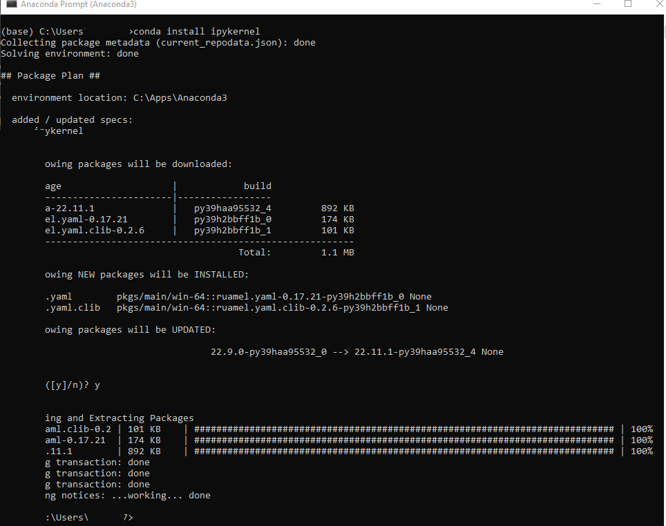
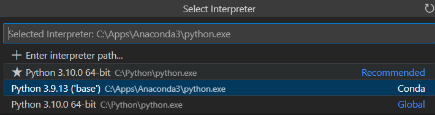

# PySpark + Python + Jypyter Notebook

## PySpark + Python + Jypyter Notebook + VSCode

### Steps A

1. Anaconda

2. Anaconda Prompt

```dos
conda install ipykernel
```



3. VSCode
4. Install Python extension
5. Python: Select Interpreter



6. Trust
7. Create: New Jupyter Notebook
8. Firewall
9. Notebook

### Steps B

1. Anaconda

```dos
conda config --set channel_priority strict
conda env create -f golden_scenario_env.yml
conda info --envs
conda activate golden_scenario_env
conda install python=3.7
```

```dos
python -m ipykernel install --user --name golden_scenario_env --display-name "Golden Scenario Env"
```

2. VSCode

### Steps C (With docker)

```dos
docker pull jupyter/datascience-notebook
docker images
docker run --rm -t -d --name=jupyter -p 8888:8888 <imageId>
```
