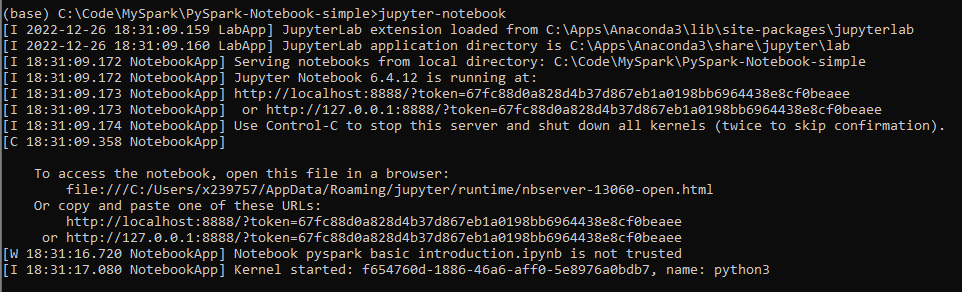

# PySpark + Python + Jypyter Notebook + VSCode

VSCode has built-in support on Jypyter Notebook.

## No Conda

### PySpark + Python + Jypyter Notebook + VSCode: MacOS

- Python

```bash
me ~ % brew install python
Warning: python@3.10 3.10.9 is already installed and up-to-date.
To reinstall 3.10.9, run:
  brew reinstall python@3.10
me ~ % brew link python@3.10
Warning: Already linked: /usr/local/Cellar/python@3.10/3.10.9
To relink, run:
  brew unlink python@3.10 && brew link python@3.10
me ~ % brew link --overwrite python@3.10
Warning: Already linked: /usr/local/Cellar/python@3.10/3.10.9
To relink, run:
  brew unlink python@3.10 && brew link python@3.10
me ~ % ls -l /usr/local/bin/2*
lrwxr-xr-x  1 x239757  admin  37 26 Dec 19:55 /usr/local/bin/2to3 -> ../Cellar/python@3.10/3.10.9/bin/2to3
lrwxr-xr-x  1 x239757  admin  42 26 Dec 19:55 /usr/local/bin/2to3-3.10 -> ../Cellar/python@3.10/3.10.9/bin/2to3-3.10
lrwxr-xr-x  1 root     wheel  70 11 Aug 15:26 /usr/local/bin/2to3-3.7 -> ../../../Library/Frameworks/Python.framework/Versions/3.7/bin/2to3-3.7
me ~ % 
```

Note:

```bash
me % cd /usr/local/bin
me % ls -la | grep pip
lrwxr-xr-x    1 x239757  admin       37 26 Dec 19:55 pip3 -> ../Cellar/python@3.10/3.10.9/bin/pip3
lrwxr-xr-x    1 x239757  admin       40 26 Dec 19:55 pip3.10 -> ../Cellar/python@3.10/3.10.9/bin/pip3.10
lrwxrwxr-x    1 root     admin       68 11 Aug 15:27 pip3.7 -> ../../../Library/Frameworks/Python.framework/Versions/3.7/bin/pip3.7
me % ls -la | grep python
lrwxr-xr-x    1 x239757  admin       37 26 Dec 19:55 2to3 -> ../Cellar/python@3.10/3.10.9/bin/2to3
lrwxr-xr-x    1 x239757  admin       42 26 Dec 19:55 2to3-3.10 -> ../Cellar/python@3.10/3.10.9/bin/2to3-3.10
lrwxr-xr-x    1 x239757  admin       38 26 Dec 19:55 idle3 -> ../Cellar/python@3.10/3.10.9/bin/idle3
lrwxr-xr-x    1 x239757  admin       41 26 Dec 19:55 idle3.10 -> ../Cellar/python@3.10/3.10.9/bin/idle3.10
lrwxr-xr-x    1 x239757  admin       37 26 Dec 19:55 pip3 -> ../Cellar/python@3.10/3.10.9/bin/pip3
lrwxr-xr-x    1 x239757  admin       40 26 Dec 19:55 pip3.10 -> ../Cellar/python@3.10/3.10.9/bin/pip3.10
lrwxr-xr-x    1 x239757  admin       39 26 Dec 19:55 pydoc3 -> ../Cellar/python@3.10/3.10.9/bin/pydoc3
lrwxr-xr-x    1 x239757  admin       42 26 Dec 19:55 pydoc3.10 -> ../Cellar/python@3.10/3.10.9/bin/pydoc3.10
lrwxr-xr-x    1 x239757  admin       40 26 Dec 19:55 python3 -> ../Cellar/python@3.10/3.10.9/bin/python3
lrwxr-xr-x    1 x239757  admin       47 26 Dec 19:55 python3-config -> ../Cellar/python@3.10/3.10.9/bin/python3-config
lrwxr-xr-x    1 x239757  admin       43 26 Dec 19:55 python3.10 -> ../Cellar/python@3.10/3.10.9/bin/python3.10
lrwxr-xr-x    1 x239757  admin       50 26 Dec 19:55 python3.10-config -> ../Cellar/python@3.10/3.10.9/bin/python3.10-config
lrwxr-xr-x    1 root     wheel       71 11 Aug 15:26 python3.7 -> ../../../Library/Frameworks/Python.framework/Versions/3.7/bin/python3.7
lrwxr-xr-x    1 root     wheel       78 11 Aug 15:26 python3.7-config -> ../../../Library/Frameworks/Python.framework/Versions/3.7/bin/python3.7-config
lrwxr-xr-x    1 root     wheel       72 11 Aug 15:26 python3.7m -> ../../../Library/Frameworks/Python.framework/Versions/3.7/bin/python3.7m
lrwxr-xr-x    1 root     wheel       79 11 Aug 15:26 python3.7m-config -> ../../../Library/Frameworks/Python.framework/Versions/3.7/bin/python3.7m-config
lrwxr-xr-x    1 x239757  admin       39 26 Dec 19:55 wheel3 -> ../Cellar/python@3.10/3.10.9/bin/wheel3
lrwxr-xr-x    1 x239757  admin       42 26 Dec 19:55 wheel3.10 -> ../Cellar/python@3.10/3.10.9/bin/wheel3.10
```

- VSCode

- VSCode Python extension

- VSCode "Python: Select Interpreter"

- VSCode "Create: New Jupyter Notebook"

### PySpark + Python + Jypyter Notebook + VSCode: Windows

...

## PySpark + Python + Jypyter Notebook + VSCode + Conda

### MacOS

...

### Windows

May not be needed.

Sometimes not working!

#### A

- Anaconda

- Anaconda Prompt

```dos
conda install ipykernel
conda install jupyter
cd\<MyFolder>
jupyter-notebook
```



#### B

- Anaconda

- Anaconda Prompt

```dos
conda install ipykernel
```


- VSCode
- Install Python extension
- Python: Select Interpreter


- Trust
- Create: New Jupyter Notebook
- Firewall
- Notebook

#### C

1. Anaconda

```dos
conda config --set channel_priority strict
conda env create -f golden_scenario_env.yml
conda info --envs
conda activate golden_scenario_env
conda install python=3.7
```

```dos
python -m ipykernel install --user --name golden_scenario_env --display-name "Golden Scenario Env"
```

- VSCode

## PySpark + Python + Jypyter Notebook + Docker

```dos
docker pull jupyter/datascience-notebook
docker images
docker run --rm -t -d --name=jupyter -p 8888:8888 <imageId>
docker run --rm -t -d --name=jupyter -p 8888:8888 --mount src="$(pwd)",target=/app,type=bind jupter_v2:latest
```

`docker run --rm -t -d --name=jupyter -p 8888:8888 --mount src=C:\Code\MySpark\PySpark-Notebook-simple,target=/app,type=bind jupter_v2:latest`
