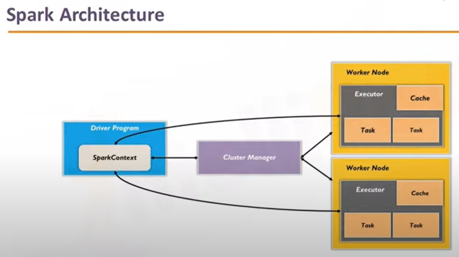

# MySpark

My Spark

Spark is written in Scala.

## A good example for Spark to beat MapReduce

A credit card company needs to handel tons of fraud data in realtime.

If Hadoop & MapReduce,

- need to install Hive/Impala for SQL

- need to install Storm for realtime processing

- need to install mahout for machine learning

But Spark

- Spark streaming for data streaming process

- Spark MLib for machine learning

- 100x faster than MapReduce

## Partitioning considerations

- Number of executors

- RAM

- CPU

## Keywords

Spark SQL

Spark Streaming

Spark Core

RDD

Sprak-shell

PySpark

SparkContext

Scala / Python: Dynamic Type Inference

But the best practice is - don't let Scala to guess the data type.

## Screenshot

