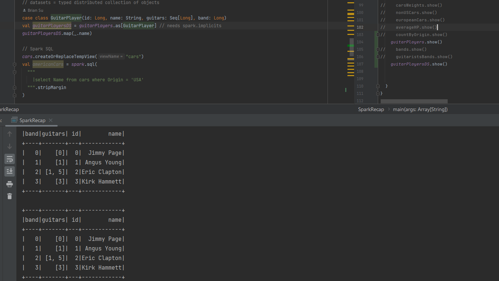

# MySpark

Spark is written in Scala.

Apache Spark is a unified analytics engine for processing large volumes of data. It can run workloads 100 times faster and offers over 80 high-level operators that make it easy to build parallel apps. Spark can run on Hadoop, Apache Mesos, Kubernetes, standalone, or in the cloud, and can access data from multiple sources.

## Spark Streaming

### Spark Streaming With Scala

- Spark Structured Streaming
  - Streaming DataFrames
  - Streaming Aggregations
  - Streaming Joins
  - Streaming Datasets
- Low-Level Spark Streaming with DStreams
  - DStreams
  - DStreams Transformations
- Spark Streaming Integrations
  - Kafka & Structured Streaming
  - Kafka & DStreams
  - JDBC with PostgreSQL
  - Cassandra
- Advanced Spark Streaming
  - Event Time Windows
  - Processing Time Windows
  - Watermarking

### Real-time Stream Processing applications using Apache Spark

- Spark Structured Streaming
  - Streaming APIs: DStreams vs Structured Streaming
  - Stream processing model
  - Streaming sources, sinks and output mode
  - Fault tolerance and restarts
- Spark Streaming with Kafka
  - Streaming from Kafka source
  - Working with Kafka sinks
  - Multi-query Streams Application
  - Kafka serialization and deserialization for Spark
  - Creating Kafka AVRO sinks
  - Working with Kafka AVRO source
- Windows and Aggregates
  - Stateless vs Stateful transformations
  - Event time and Windowing
  - Tumbling Window aggregate
  - Watermarking your windows
  - Watermark and output modes
  - Sliding Windows
- Stream Processing and Joins
  - Join Stream to static source
  - Join Stream to another Stream
  - Streaming Watermark
  - Streaming Outer Joins

## A good example for Spark to beat MapReduce

A credit card company needs to handel tons of fraud data in realtime.

With Hadoop & MapReduce

- need to install Hive/Impala for SQL

- need to install Storm for realtime processing

- need to install mahout for machine learning

With Spark

- Spark streaming for data streaming process

- Spark MLib for machine learning

- 100x faster than MapReduce

## Spark mini project

Perform the following analytics on the data

- Show the number of students in the file.
- Show the total marks achieved by Female and Male students
- Show the total number of students that have passed and failed. 50+ marks are required to pass the course.
- Show the total number of students enrolled per course
- Show the total marks that students have achieved per course
- Show the average marks that students have achieved per course
- Show the minimum and maximum marks achieved per course
- Show the average age of male and female students

## Keywords

Spark Structured API

Spark SQL

Spark Streaming

Spark Core

RDD

Sprak-shell

PySpark

SparkContext

Scala / Python: Dynamic Type Inference

But the best practice is - don't let Scala to guess the data type.

Sprak Streaming vs Apache Storm vs Apache Flink vs Kafka Streams

Micro batch architecture

Dynamic Resource Allocation

Databricks

RDD

Spark Configuration Object (settings and configuration)

```dos
Create Spark configuration Object 
-> Initialize the SparkContext object with Spark configuration object 
-> Spark Session
```

## General information

[Spark Info](SparkInfo.md)

## Keywords + Code

Spark Structured API

SparkSession

```dos
org.apache.spark.sql.SparkSession.Builder
def master(master: String): SparkSession.Builder
Sets the Spark master URL to connect to, such as "local" to run locally, "local[4]" to run locally with 4 cores, or "spark://master:7077" to run on a Spark standalone cluster.

org.apache.spark.sql.SparkSession.Builder
def getOrCreate(): SparkSession
Gets an existing SparkSession or, if there is no existing one, creates a new one based on the options set in this builder.
This method first checks whether there is a valid thread-local SparkSession, and if yes, return that one. It then checks whether there is a valid global default SparkSession, and if yes, return that one. If no valid global default SparkSession exists, the method creates a new SparkSession and assigns the newly created SparkSession as the global default.
In case an existing SparkSession is returned, the non-static config options specified in this builder will be applied to the existing SparkSession.

e.g.

  // the entry point to the Spark structured API
  val spark = SparkSession.builder()
    .appName("Spark Recap")
    .master("local[2]")
    .getOrCreate()
```

DF - read

```dos
org.apache.spark.sql.SparkSession
def read: DataFrameReader
Returns a DataFrameReader that can be used to read non-streaming data in as a DataFrame.
sparkSession.read.parquet("/path/to/file.parquet")
sparkSession.read.schema(schema).json("/path/to/file.json")

e.g.
  // read a DF
  val cars = spark.read
    .format("json")
    .option("inferSchema", "true")
    .load("src/main/resources/data/cars")
```

DF - select

```dos
org.apache.spark.sql.Dataset
@varargs
def select(cols: Column*): sql.DataFrame
Selects a set of column based expressions.
ds.select($"colA", $"colB" + 1)

e.g.

  // select
  val usefulCarsData = cars.select(
    col("Name"), // column object
    $"Year", // another column object (needs spark implicits)
    (col("Weight_in_lbs") / 2.2).as("Weight_in_kg"),
    expr("Weight_in_lbs / 2.2").as("Weight_in_kg_2")
  )
```

DF - selectExpr

```dos
org.apache.spark.sql.Dataset
@varargs
def selectExpr(exprs: String*): sql.DataFrame
Selects a set of SQL expressions. This is a variant of select that accepts SQL expressions.
// The following are equivalent:
ds.selectExpr("colA", "colB as newName", "abs(colC)")
ds.select(expr("colA"), expr("colB as newName"), expr("abs(colC)"))

e.g.

  val carsWeights = cars.selectExpr("Weight_in_lbs / 2.2")
```

DF - where / filter

```dos
org.apache.spark.sql.Dataset
def where(condition: Column): Dataset[T]
Filters rows using the given condition. This is an alias for filter.
// The following are equivalent:
peopleDs.filter($"age" > 15)
peopleDs.where($"age" > 15)

e.g.

  // filter
  val europeanCars = cars.where(col("Origin") =!= "USA")
```

DF - aggregations / avg, sum, meam, stddev, min, max

```dos
org.apache.spark.sql.functions
def avg(e: Column): Column
Aggregate function: returns the average of the values in a group.

e.g.

  // aggregations
  val averageHP = cars.select(avg(col("Horsepower")).as("average_hp"))
```

DF - groupBy / grouping

```dos
org.apache.spark.sql.Dataset
@varargs
def groupBy(cols: Column*): RelationalGroupedDataset
Groups the Dataset using the specified columns, so we can run aggregation on them. See RelationalGroupedDataset for all the available aggregate functions.
// Compute the average for all numeric columns grouped by department.
ds.groupBy($"department").avg()

// Compute the max age and average salary, grouped by department and gender.
ds.groupBy($"department", $"gender").agg(Map(
  "salary" -> "avg",
  "age" -> "max"
))

e.g.

  // grouping
  val countByOrigin = cars
    .groupBy(col("Origin")) // a RelationalGroupedDataset
    .count()

```

Findings


vs


DF - joining

```dos
org.apache.spark.sql.Dataset
def join(right: Dataset[_], joinExprs: Column): sql.DataFrame
Inner join with another DataFrame, using the given join expression.
// The following two are equivalent:
df1.join(df2, $"df1Key" === $"df2Key")
df1.join(df2).where($"df1Key" === $"df2Key")

e.g.

  // joining
  val guitarPlayers = spark.read
    .option("inferSchema", "true")
    .json("src/main/resources/data/guitarPlayers")

  val bands = spark.read
    .option("inferSchema", "true")
    .json("src/main/resources/data/bands")

  val guitaristsBands = guitarPlayers.join(bands, guitarPlayers.col("band") === bands.col("id"))
  /*
    join types
    - inner: only the matching rows are kept
    - left/right/full outer join
    - semi/anti
   */
```

No differences?

```dos
  // datasets = typed distributed collection of objects
  case class GuitarPlayer(id: Long, name: String, guitars: Seq[Long], band: Long)
  val guitarPlayersDS = guitarPlayers.as[GuitarPlayer] // needs spark.implicits
  guitarPlayersDS.map(_.name)
```

vs

```dos
  // datasets = typed distributed collection of objects
  case class GuitarPlayer(id: Long, name: String, guitars: Seq[Long], band: Long)
  val guitarPlayersDS = guitarPlayers.as[GuitarPlayer] // needs spark.implicits
  // guitarPlayersDS.map(_.name)
```



Spark SQL

```dos
org.apache.spark.sql.Dataset
def createOrReplaceTempView(viewName: String): Unit
Creates a local temporary view using the given name. The lifetime of this temporary view is tied to the SparkSession that was used to create this Dataset.

e.g.

  val nonUSACars = spark.sql(
    """
      |select Name, Origin from cars where Origin != 'USA'
    """.stripMargin
  )
```

Low-level API: RDDs

sparkContext

## CPU cores

Looks like the mbp is much better than Windows for Spark Scala.

- JDK is free
- No need to set up winutils.exe, hadoop and spark in Windows
- Faster becuse of the multiple cores


## Netcat

Netcat Fundamentals

```dos
nc [options] [host] [port] – by default this will execute a port scan

nc -l [host] [port] – initiates a listener on the given port
```

Netcat Command Flags

```dos
nc -4 – use IPv4 only

nc -6 – use IPv6

nc -u – use UDP instead of TCP

nc -k -l – continue listening after disconnection

nc -n – skip DNS lookups

nc -v – provide verbose output
```

e.g.

```dos
nc -lk 12345
```
