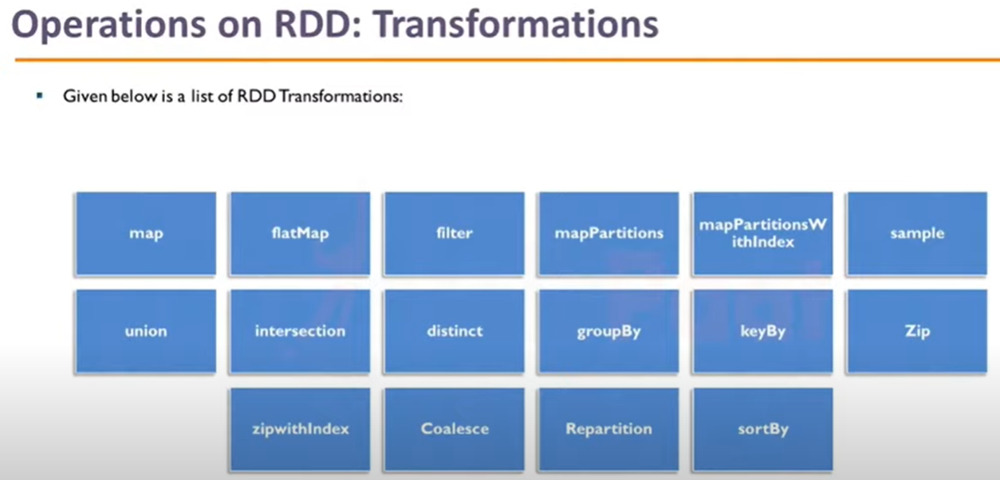
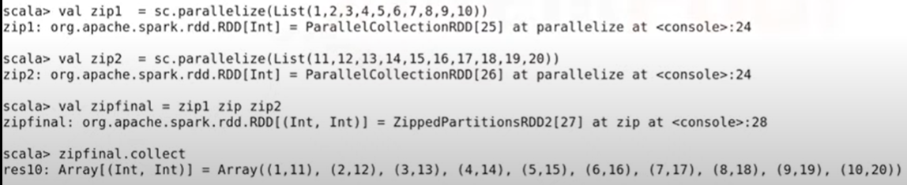
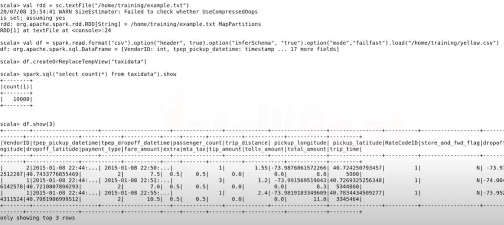
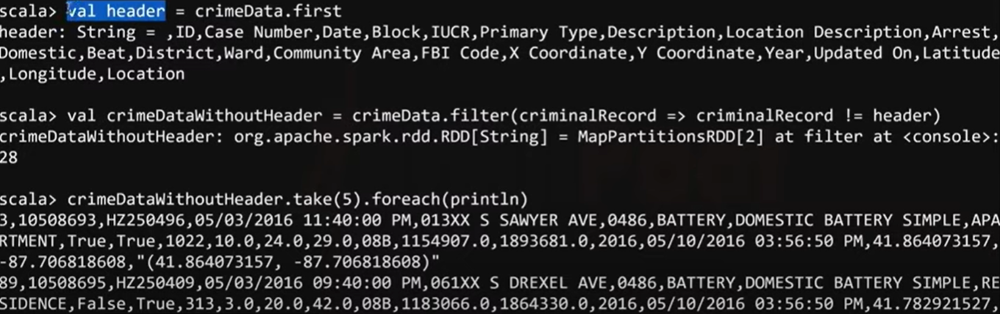

# MySpark

Spark is written in Scala.

## A good example for Spark to beat MapReduce

A credit card company needs to handel tons of fraud data in realtime.

With Hadoop & MapReduce

- need to install Hive/Impala for SQL

- need to install Storm for realtime processing

- need to install mahout for machine learning

With Spark

- Spark streaming for data streaming process

- Spark MLib for machine learning

- 100x faster than MapReduce

## Partitioning considerations

- Number of executors

- RAM

- CPU

## Keywords

Spark SQL

Spark Streaming

Spark Core

RDD

Sprak-shell

PySpark

SparkContext

Scala / Python: Dynamic Type Inference

But the best practice is - don't let Scala to guess the data type.

Sprak Streaming vs Apache Storm vs Apache Flink vs Kafka Streams

Micro batch architecture

Dynamic Resource Allocation

Databricks

RDD

Spark Configuration Object (settings and configuration)

```dos
Create Spark configuration Object 
-> Initialize the SparkContext object with Spark configuration object 
-> Spark Session
```

## The Spark Ecosystem

Spark Core

It provides the base functionality for the components on top of it, like scheduling and monitoring of jobs in a cluster and handling faults. Though Spark is developed in the Scala programming language, it also provides an API for other languages like R, SQL, Python, and Java. These languages, especially R and Python, are the most popular in data science, which is one of the reasons Spark is so popular.

Spark SQL + Dataframes

This is a module that provides a structured data processing interface via SQL, which is a language used for communicating with a database. It also provides the Dataframe format, which is used to structure data into columns and rows.

Streaming

In some applications, we need a result from a data processing within a specific time limit, failing which it becomes useless. For instance, to detect fraud in a credit card transaction. This module can be used in situations we need real-time performance.

ML/Mlib

Machine Learning (ML) is everywhere today, from recommendations on sites like Netflix and LinkedIn to advanced technologies like self-driving cars. This module provides state of the art algorithms to learn from data and make models with it, to be able to make predictions.

GraphX

A module that can handle graph-structured data at scale. One can think of visualizing Facebook relations or analyzing flight data.

## Why Is Spark so Popular?

There are a couple of reasons why Spark is so popular and why there is a massive demand for people with Spark skills -

Speed

The main benefits is the fast processing of big datasets. It is fast because it processes the data in memory, and it uses cluster technology. This means that a particular task can be divided into sub-tasks, and these sub-tasks are computed on different hosts in a cluster. This clustering technology is not new as it’s also used in Hadoop MapReduce, sometimes called the predecessor of Spark. While in Hadoop MapReduce, all tasks are performed on disk, Spark performs them in-memory, which is a lot faster. Spark is nearly 100 times as fast as Hadoop MapReduce. A couple of years ago, it broke the record for sorting a petabyte. It is also possible to use Spark on your local machine without using a cluster.  I have used it this way in my last project where I had to predict click-through rates for a marketing company. Loading the client’s data and building the prediction model took about 15 minutes at first. When I added Spark, which can utilize all cores on my machine, it took only 3 minutes.

Ease of Use

It provides support for the main languages used in data processing like Java, Scala, R, and Python. The documentation is pretty good, and it’s relatively easy to create a simple application in your preferred language.  It also provides a way to use it interactively, which is handy to experiment with before you write your program.

Supports Many Use Cases

It is a complete framework that supports multiple use cases. Ranging from Machine Learning to Stream processing and Graph processing, Spark has quite a lot of functionality available that gets you up and running quickly.

Integration with Other Technologies

Spark can run on different cluster technologies like the Hadoop file-system, YARN, and Amazon web services (AWS). AWS, which has been supporting Spark for some time, now, has the advantage that you don’t have to set up and maintain a cluster yourself, saving you valuable time.

## Images














